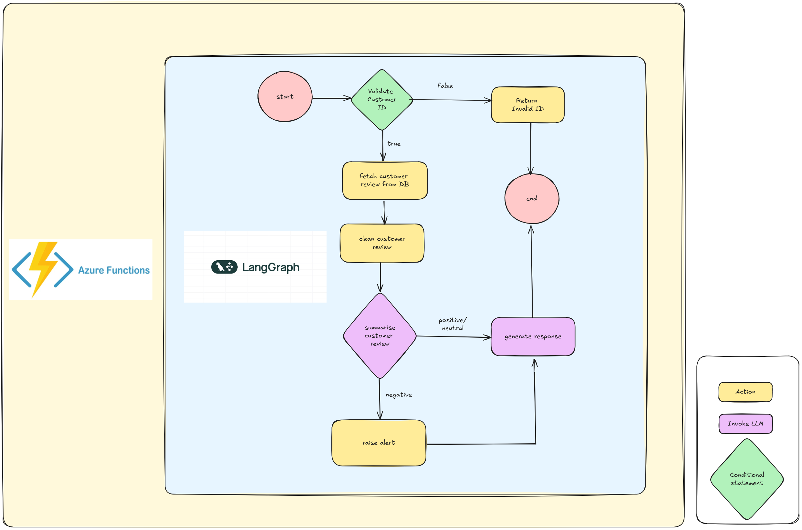

# Function App

This repository contains a Python-based Azure Function App. It is structured to be deployed on Azure using the Functions runtime and is managed via dependencies defined in `pyproject.toml`.

## 🚀 Getting Started

### 1. Install `uv`

```bash
curl -Ls https://astral.sh/uv/install.sh | sh
```

### 2. Set up the Environment

```bash
uv sync
```

### 3. Add .env configurations

```bash
AZURE_OPENAI_API_KEY=<azure_openai_api_key>
AZURE_OPENAI_API_TYPE=azure
AZURE_OPENAI_ENDPOINT= https://openai.openai.azure.com/openai/deployments/<deployment_name>/chat/completions?api-version=<api_version>
OPENAI_API_VERSION=<api_version>
OPENAI_DEPLOYMENT_NAME=<deployment_name>
```

### 4. Run locally with Azure Functions Core Tools

```bash
func start
```

### 5. Testing

```bash
[POST] http://localhost:7071/api/route
Body:
{
    "customer_review_id": "456"
}
```

## 🧭 Project Overview

This solution is triggered by an Azure Function App, which initiates a LangGraph state machine consisting of 7 interconnected nodes:



- Validate – Checks whether the provided user ID exists. Currently uses mock data, which can be replaced with a real database in production.

- Invalid_ID – Returns an error response if the user ID is not found.

- Fetch – Retrieves the user's review from the database and stores it in the graph context.

- Prepare – Cleans and preprocesses the review content.

- Summarise – Uses Azure OpenAI’s GPT-4o-mini model to analyze the review and return a JSON with sentiment classification and explanation.

- Raise_Alert – If the sentiment is negative, this node triggers alert mechanisms such as logging or email notifications.

- Generate_Response – Uses an LLM to craft a user-friendly message based on the summarized review.
